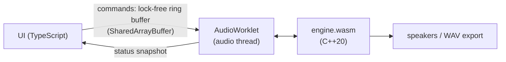

# WebRack

[](https://github.com/hansonq888/webrack/actions/workflows/ci.yml)

A beat machine and slowed + reverb tool that runs in the browser. No install, no account, and your audio never leaves your device.

**Try it:** [webrack.hansonqin.com](https://webrack.hansonqin.com)

- **Make a beat:** 16 pads, record your voice onto any pad, and program a step sequencer (16, 32 or 64 steps).
- **Slow a song:** drop in a track and slow it down with reverb, a DJ filter, drive and EQ. Then export it as a WAV.

I built the audio engine from scratch in C++ and compiled it to WebAssembly. The UI is TypeScript with no framework.

## How it works



The browser calls the AudioWorklet every 128 samples (about 2.7 ms at 48 kHz). The worklet asks the C++ engine to fill that block, so all the audio work happens in C++. The TypeScript side only sends commands (pad hits, knob changes) and draws the UI.

**Engine signal chain:**

```
sampler (16 voices) + sequencer + song player
  → varispeed → drive → DJ filter → 3-band EQ → reverb → stereo width → soft clip
```

Some things I cared about:

- **Nothing blocks the audio thread.** The UI talks to the worklet through a single-producer single-consumer ring buffer in shared memory, so there are no locks and no allocations while audio is running. A test counts allocations in `process()` and expects 0.
- **Sample-accurate sequencing.** The engine splits each block at the exact sample where a step lands, so timing doesn't drift or snap to block boundaries. A test checks every hit's sample index across different tempos and speeds.
- **The WASM has no imports.** It's built with `-sSTANDALONE_WASM` and a fixed memory size, and the worklet instantiates it directly without any Emscripten JS glue.
- **Export uses the same code.** Exporting runs the same worklet and engine inside an `OfflineAudioContext`, so the file sounds exactly like what you heard.
- **SIMD where the time goes.** Profiling showed the sampler's interpolation and the reverb's delay lines were the hot spots, so both run 4 samples at a time with WebAssembly SIMD128. The output is bit-identical to the scalar code, and a test checks that.

The DSP I wrote for this project:
- Freeverb-style reverb with pre-delay and an input high-pass.
- A zero-delay-feedback state-variable filter for the DJ filter, so it stays stable while you sweep it.
- RBJ biquads for the EQ.
- Hermite interpolation for varispeed.
- tanh drive and a soft clipper.
- Voice stealing and per-pad choke, with short fades so they don't click.

## Is C++ actually faster here?

I wanted to check this instead of just assuming it, so I ported the engine line by line to TypeScript and ran both on the same inputs. The outputs match to within 76 dB below the signal. The scenario is the worst case the app can produce: 16 voices always sounding and being stolen, a song on top, 0.8× speed, EQ and reverb.

**In Node 22** (10 minutes of audio per engine, 3 runs, Apple M5 Pro):

| | median block time | throughput |
|---|---|---|
| C++ → WASM (SIMD) | 8.0 to 8.2 µs | 327 to 330× real time |
| C++ → WASM (before SIMD) | 11.1 to 11.4 µs | 210 to 233× real time |
| JavaScript | 18.5 to 18.7 µs | 147 to 148× real time |

WASM is now **2.2× faster than JavaScript** in throughput. It was 1.7× before SIMD, and SIMD alone made the engine 1.35× faster.

**In the browser.** The [`/bench`](https://webrack.hansonqin.com/bench/) page runs the same benchmark in your browser. It has two modes:
- **Web Worker:** WASM vs JavaScript. In Chrome 152 the mean block time was 7.8 µs for WASM and 16.2 µs for JavaScript, which is 2.1×.
- **Real audio thread:** the engine inside an AudioWorklet, in real time. Chrome gives AudioWorklets no timer, so a Web Worker spins an atomic counter in a `SharedArrayBuffer` and the worklet reads it around each render call. That is about 9 ns resolution, calibrated against `performance.now()`. Over 30 s in Chrome 152 the median was 9.1 µs and the p99 20 µs, with 0 of 11,250 blocks over budget.

To be honest, both engines are far under the 2.7 ms budget on a laptop. The difference matters more on slower phones and for heavier DSP.

**SIMD notes.** Compiler auto-vectorization gained nothing, because the hot loops have feedback. So I restructured them by hand:
- **Reverb:** each comb and allpass filter now processes a whole block before the next filter starts. Every delay line is over 200 samples long, so 4 neighboring samples never depend on each other, and they are loaded, computed and stored together.
- **Sampler:** each voice interpolates 4 output samples at once, with the 4 read positions gathered into one vector.

The shipped binary has 55 `v128.load`, 73 `v128.store` and 61 `f32x4` add/mul instructions, and none before. Native builds use `-ffp-contract=off` so their float math matches WASM exactly, which is what lets a native test prove the SIMD and scalar paths agree bit for bit.

**Lock-free queue in C++.** `engine/src/spsc_queue.hpp` is a single-producer single-consumer ring buffer with `std::atomic` release/acquire indices on separate cache lines. Its tests include two-thread stress runs of up to 50 million items, run under ThreadSanitizer in CI; optimized, it moves 17.5 million items a second. To choose the padding I measured false sharing directly (`engine/test.sh cacheline`): two threads writing counters less than 64 bytes apart were 6.9× slower per write than counters on separate lines. macOS reports a 128-byte line, but 64 was enough on an M5. The browser's ring (`ring.ts`) uses the same algorithm with JavaScript `Atomics`, which are sequentially consistent, and now puts its head and tail on separate 128-byte lines too.

Other numbers:
- Native worst-case chain: p50 6.8 µs, p99 11.1 µs per block (0.4% of the budget), with 0 blocks over budget in a 10-minute soak test.
- Exporting a 3-minute slowed + reverb song takes under 1 second.
- The whole app (JS, CSS and WASM) is about 60 KB gzipped, not counting fonts.

## Running it

You need Node 22+. Rebuilding the engine also needs [Emscripten](https://emscripten.org).

```bash
cd app && npm install && npm run dev   # app on localhost
cd engine && ./test.sh                 # native engine tests
cd engine && ./test.sh bench           # 10-minute soak benchmark
cd engine && ./test.sh spsc            # lock-free queue, under ThreadSanitizer too
cd engine && ./test.sh cacheline       # false-sharing benchmark
cd engine && ./build.sh                # rebuild app/public/engine.wasm
cd app && npm run bench                # JS vs WASM benchmark in Node
```

The in-browser benchmark is at `/bench/` on the dev server. CI runs the native tests, rebuilds `engine.wasm` to check the committed one is current, and type-checks, builds and tests the app.

## What's next

- Pitch-preserving time-stretch (phase vocoder), so slowing a song keeps its key.
- Run `/bench` on Safari, Firefox and a phone, and publish the numbers.
- SIMD for the EQ, by running the left and right channels' filters side by side.
