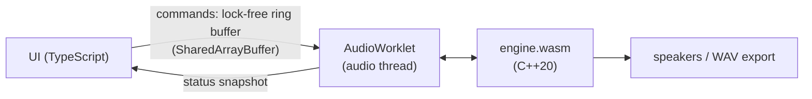

# WebRack

A beat machine and slowed + reverb tool that runs in the browser. No install, no account, and your audio never leaves your device.

**Try it:** [webrack.hansonqin.com](https://webrack.hansonqin.com)

- **Make a beat:** 16 pads, record your voice onto any pad, and program a step sequencer (16, 32 or 64 steps).
- **Slow a song:** drop in a track and slow it down with reverb, a DJ filter, drive and EQ. Then export it as a WAV.

I built the audio engine from scratch in C++ and compiled it to WebAssembly. The UI is TypeScript with no framework.

## How it works



The browser calls the AudioWorklet every 128 samples (about 2.7 ms at 48 kHz). The worklet asks the C++ engine to fill that block, so all the audio work happens in C++. The TypeScript side only sends commands (pad hits, knob changes) and draws the UI.

**Engine signal chain:**

```
sampler (16 voices) + sequencer + song player
  → varispeed → drive → DJ filter → 3-band EQ → reverb → stereo width → soft clip
```

Some things I cared about:

- **Nothing blocks the audio thread.** The UI talks to the worklet through a single-producer single-consumer ring buffer in shared memory, so there are no locks and no allocations while audio is running. A test counts allocations in `process()` and expects 0.
- **Sample-accurate sequencing.** The engine splits each block at the exact sample where a step lands, so timing doesn't drift or snap to block boundaries. A test checks every hit's sample index across different tempos and speeds.
- **The WASM has no imports.** It's built with `-sSTANDALONE_WASM` and a fixed memory size, and the worklet instantiates it directly without any Emscripten JS glue.
- **Export uses the same code.** Exporting runs the same worklet and engine inside an `OfflineAudioContext`, so the file sounds exactly like what you heard.

The DSP I wrote for this project:
- Freeverb-style reverb with pre-delay and an input high-pass.
- A zero-delay-feedback state-variable filter for the DJ filter, so it stays stable while you sweep it.
- RBJ biquads for the EQ.
- Hermite interpolation for varispeed.
- tanh drive and a soft clipper.
- Voice stealing and per-pad choke, with short fades so they don't click.

## Is C++ actually faster here?

I wanted to check this instead of just assuming it, so I ported the engine line by line to TypeScript and ran both on the same inputs. The outputs match to within 76 dB below the signal. Results are from 10 minutes of audio on an M5 Pro in Node 22, 3 runs:

| | median block time | throughput |
|---|---|---|
| C++ → WASM | 11.1 to 11.4 µs | 210 to 233× real time |
| JavaScript | 19.2 to 19.3 µs | 126 to 134× real time |

WASM was about **1.7× faster** in every run. To be honest, both are way under the 2.7 ms budget on a laptop. The difference matters more on slower phones and for heavier DSP, which is where I want to take this next.

Other numbers:
- Native worst-case chain: p99 of 13 µs per block (0.5% of the budget), with 0 blocks over budget in a 10-minute soak test.
- Exporting a 3-minute slowed + reverb song takes under 1 second.
- The whole app (JS, CSS and WASM) is about 60 KB gzipped, not counting fonts.

## Running it

You need Node 22+. Rebuilding the engine also needs [Emscripten](https://emscripten.org).

```bash
cd app && npm install && npm run dev   # app on localhost
cd engine && ./test.sh                 # native engine tests
cd engine && ./test.sh bench           # 10-minute soak benchmark
cd engine && ./build.sh                # rebuild app/public/engine.wasm
cd app && npm run bench                # JS vs WASM benchmark
```

## What's next

- Pitch-preserving time-stretch (phase vocoder), so slowing a song keeps its key.
- Hand-written SIMD for the reverb and voices.
- A `/bench` page to compare Chrome, Safari and Firefox, and to test on phones.
